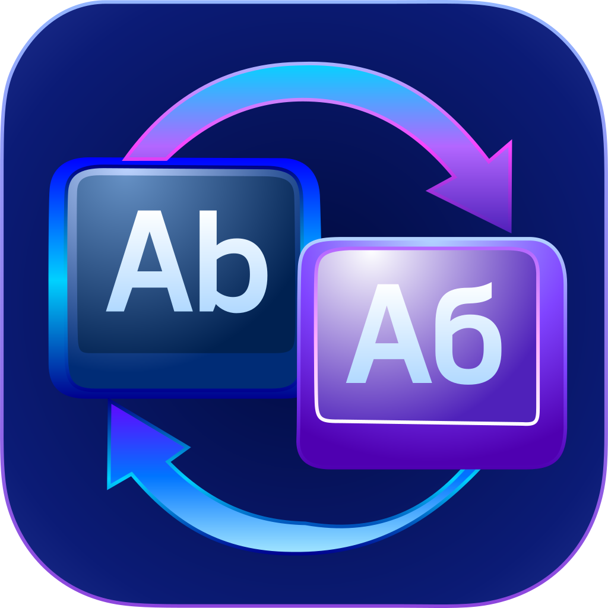

# SwitchFix

macOS menu bar utility that auto-corrects keyboard layout mistakes. Type in the wrong layout (English instead of Ukrainian/Russian) and SwitchFix detects it, deletes the mistyped word, switches the layout, and retypes the correct text — like PuntoSwitcher, but native and lightweight.




## Features

- **Automatic correction** — detects wrong-layout words on space/enter and corrects them instantly
- **Hotkey mode** — correct only when you press Ctrl+Shift+Space (configurable)
- **Selection correction** — select text and press the hotkey to convert it
- **Undo** — Cmd+Z within 5 seconds reverts the last correction
- **Revert hotkey** — CapsLock reverts the last correction (configurable)
- **Three layouts** — English (US/ABC/British/Dvorak/Colemak), Ukrainian, Russian
- **Ukrainian variants** — auto-detects and supports both Ukrainian and Ukrainian Legacy keymaps
- **Smart filtering** — skips password fields, URLs, emails, camelCase, mixed scripts
- **App blacklist** — disabled in terminals, IDEs, and code editors by default (toggle per app)
- **Launch at Login** — optional auto-start via SMAppService
- **Confidence-based switching** — delays layout switch for ambiguous short words
- **Expanded Ukrainian dictionary** — runtime `uk_UA.txt` now includes 2,958,567 normalized single-word entries
- **Binary dictionary loading** — precompiled `.bin` dictionaries are packaged for faster startup paths

## Requirements

- macOS 13.0+
- Accessibility permission (prompted on first launch)
- Input Monitoring permission (prompted on first launch)
- Swift 5.9+ and Command Line Tools (for building from source)

## Installation

Download the latest release from the [Releases page](https://github.com/rundax/SwitchFix/releases).

1. Open the downloaded `.dmg` file.
2. Drag `SwitchFix.app` to your Applications folder.
3. Launch the app. You will need to grant both Accessibility and Input Monitoring permissions for it to work.

> **Note:** Because this is a free, open-source app and is not signed with a paid Apple Developer certificate ($99/yr), macOS Gatekeeper will try to block it. 
> 
> * If you see **"App cannot be opened because the developer cannot be verified"**: Right-click (or Control-click) the app and choose **Open**.
> * If you see **"SwitchFix is damaged and can't be opened"**: Open your Terminal and run this command:
>   `xattr -cr /Applications/SwitchFix.app`

### macOS 13/14 and older versions

- Yes, users on macOS 13 can build and run the current app from source.
- Release artifacts are built on GitHub macOS 15 runners, but the app target is still macOS 13+.
- If a downloaded release does not launch on your Mac, build locally:

```bash
xcode-select --install
swift --version
scripts/build-app.sh
scripts/create-dmg.sh
```

- macOS 12 and older are currently unsupported by this repository (minimum target is macOS 13 in `Package.swift`).

## Build

```bash
# Debug build
swift build

# Run tests (standalone runner — no Xcode required)
swift run TestRunner

# Build .app bundle (ad-hoc signed)
scripts/build-app.sh

# Optional: use a stable signing identity to preserve TCC permissions across rebuilds
SWITCHFIX_CODESIGN_IDENTITY="Apple Development: Your Name (TEAMID)" scripts/build-app.sh

# Create DMG for distribution
scripts/create-dmg.sh
```

The built app is at `dist/SwitchFix.app`.

### TCC permissions in dev builds

If you use ad-hoc signing (default), macOS may treat each rebuilt app as a new binary and drop Accessibility/Input Monitoring approval.

Use:

```bash
scripts/regrant-permissions.sh
```

Or set `SWITCHFIX_CODESIGN_IDENTITY` when building so permissions remain stable across rebuilds.

## GitHub Releases (arm64 + Intel)

The release workflow builds and uploads separate assets for Apple Silicon and Intel:

- `SwitchFix-arm64.dmg`
- `SwitchFix-intel.dmg`
- `SwitchFix-arm64.app.zip`
- `SwitchFix-intel.app.zip`
- `AppIcon.svg`

The workflow runs on tag push (`v*`).

### Signing used by current release workflow

By default, CI builds are **ad-hoc signed**.

You can set signing identity in CI by configuring secrets:

- `SWITCHFIX_CODESIGN_IDENTITY` (for example `Developer ID Application: ...`)
- `APPLE_CERTIFICATE_P12_BASE64`
- `APPLE_CERTIFICATE_PASSWORD`

When these secrets are present, the workflow imports the certificate and signs using `SWITCHFIX_CODESIGN_IDENTITY`.

## How It Works

1. **KeyboardMonitor** installs a CGEventTap (listen-only) to capture keystrokes
2. Characters accumulate in **LayoutDetector**'s word buffer
3. On word boundary (space, enter, tab), the buffer is checked:
   - Convert the word to alternative layouts via **LayoutMapper** character tables
   - Validate each conversion against dictionary indices (binary `mmap` when available, text fallback otherwise)
   - Current dictionary sizes: EN `48,241`, UK `2,958,567`, RU `146,229` single-word entries
4. If a valid word is found in another layout, **TextCorrector**:
   - Deletes the mistyped characters (+ boundary char) via CGEvent backspaces
   - Switches the input source via TIS API
   - Retypes the correct text via `keyboardSetUnicodeString`
   - Retypes the boundary character (space/enter)

## Architecture

```
Sources/
├── SwitchFixApp/     # Entry point, AppDelegate (wires the pipeline)
├── Core/             # KeyboardMonitor, LayoutDetector, LayoutMapper,
│                     #   TextCorrector, InputSourceManager
├── Dictionary/       # DictionaryLoader, index abstractions, WordValidator
│   └── Resources/    #   en_US.txt, uk_UA.txt, ru_RU.txt, overrides/
├── UI/               # StatusBarController, PreferencesManager
└── Utils/            # Permissions (AXUIElement), AppFilter, KeyCodeMapping,
                      #   SystemHotkeyConflicts
```

## Menu Bar

SwitchFix lives in the menu bar with an **Ab** icon. The menu provides:

- **Enable/Disable** toggle
- **Correction Mode** — Automatic or Hotkey Only
- **Conflict warning** — shows when CapsLock is also used by macOS for input source switching
- **Installed Layouts** — shows all detected system layouts
- **Launch at Login**
- **Quit**

## Hotkey Configuration

SwitchFix stores hotkeys in `UserDefaults`:

- `SwitchFix_hotkeyKeyCode` + `SwitchFix_hotkeyModifiers` for correction hotkey (default: Ctrl+Shift+Space)
- `SwitchFix_revertHotkeyKeyCode` + `SwitchFix_revertHotkeyModifiers` for revert hotkey (default: CapsLock)

Examples:

```bash
# Set revert hotkey to CapsLock (no modifiers)
defaults write com.switchfix.app SwitchFix_revertHotkeyKeyCode -int 57
defaults write com.switchfix.app SwitchFix_revertHotkeyModifiers -int 0

# Set correction hotkey to Ctrl+Shift+Space
defaults write com.switchfix.app SwitchFix_hotkeyKeyCode -int 49
defaults write com.switchfix.app SwitchFix_hotkeyModifiers -int $((262144+131072))
```

If SwitchFix observes that pressing CapsLock also triggers a macOS input-source switch, it shows a conflict warning in the menu.

## Diagnostics

SwitchFix logs key decisions via `NSLog`. Open Console.app and filter for `[SwitchFix]` to see:

- Discovered input sources at startup
- Dictionary loading (word counts, paths)
- Detection decisions (buffer contents, conversion results)
- Correction actions (deletion count, layout switch, typed text)
- App switching (allowed/blocked)

## Dictionary Notes (v0.0.3)

- `uk_UA.txt` grew from `320,307` (v0.0.2) to `2,958,567` single-word entries.
- Multi-word phrases are intentionally filtered out from runtime `uk_UA.txt` (kept at `0`).
- Release bundles are larger now because `uk_UA.bin` is packaged for runtime lookup.

## License

MIT
