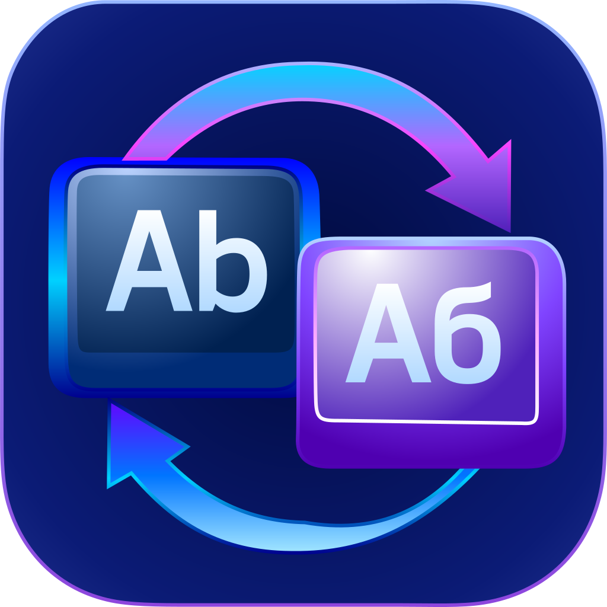

# SwitchFix

A macOS menu bar utility that automatically corrects keyboard layout mistakes. Type in the wrong layout (e.g., English instead of Ukrainian/Russian) and SwitchFix detects it, deletes the mistyped word, switches the layout, and retypes the correct text — like PuntoSwitcher, but native, lightweight, and modern.




## Features

- **Automatic correction** — detects wrong-layout words on space/enter and corrects them instantly.
- **Hotkey mode** — correct only when you press Ctrl+Shift+Space (configurable).
- **Selection correction** — select text and press the hotkey to convert it.
- **Permissions indicator** — shows the status of required macOS permissions in the app menu.
- **Undo** — `Cmd+Z` within 5 seconds reverts the last correction.
- **Revert hotkey** — `CapsLock` reverts the last correction (configurable).
- **Three layouts** — English (US/ABC/British/Dvorak/Colemak), Ukrainian, and Russian.
- **Smart filtering** — skips password fields, URLs, emails, camelCase, mixed scripts.
- **App blacklist** — disabled in terminals, IDEs, and code editors by default (toggle per app).
- **Launch at Login** — optional auto-start.

## Requirements

- macOS 13.0 or later

## Installation (Recommended)

The easiest way to install and set up SwitchFix is using the automated install script. It builds the app, installs it to your Applications folder, sets it to run at startup, and guides you through the necessary macOS privacy permissions.

1. Download or clone this repository to your Mac.
2. Open your Terminal and navigate to the SwitchFix folder.
3. Run the setup script:

```bash
./install.sh
```

4. Follow the interactive prompts to grant the required **Accessibility** and **Input Monitoring** permissions.

> **Note:** If you don't have Apple's Command Line Tools installed, the script will prompt you to install them first. Just follow the macOS prompts and re-run `./install.sh` when it finishes.

### Manual Installation (Pre-built Releases)

You can also download a pre-compiled version from the [Releases page](https://github.com/rundax/SwitchFix/releases). 
1. Open the downloaded `.dmg` file.
2. Drag `SwitchFix.app` to your Applications folder.
3. Launch the app and grant Accessibility and Input Monitoring permissions.

> **Note:** Gatekeeper might require you to right-click -> **Open** the app the first time since the pre-built releases are not signed with a paid Apple Developer certificate.

## Menu Bar Options

SwitchFix lives in your menu bar with an **Ab** icon. The menu provides:
- **Enable/Disable** toggle
- **Correction Mode** — Automatic or Hotkey Only
- **Permissions Status** — visually indicates if required permissions are granted
- **Installed Layouts** — shows all detected system layouts
- **Launch at Login** — toggle automatic startup

## Advanced Configuration

SwitchFix stores hotkeys in `UserDefaults`. You can customize them via Terminal if you prefer advanced bindings:

```bash
# Set revert hotkey to CapsLock (no modifiers)
defaults write com.switchfix.app SwitchFix_revertHotkeyKeyCode -int 57
defaults write com.switchfix.app SwitchFix_revertHotkeyModifiers -int 0

# Set correction hotkey to Ctrl+Shift+Space
defaults write com.switchfix.app SwitchFix_hotkeyKeyCode -int 49
defaults write com.switchfix.app SwitchFix_hotkeyModifiers -int $((262144+131072))
```

## How It Works

1. **KeyboardMonitor** securely captures keystrokes without blocking them.
2. Characters accumulate in a short-lived **LayoutDetector** word buffer.
3. On a word boundary (space, enter, tab), the buffer is checked against alternative layout dictionaries (e.g. checking if an English typo forms a valid Ukrainian word).
4. If a valid word is found in another layout, **TextCorrector** safely deletes the mistyped characters, switches your input layout, and retypes the correct word.

## License

MIT
