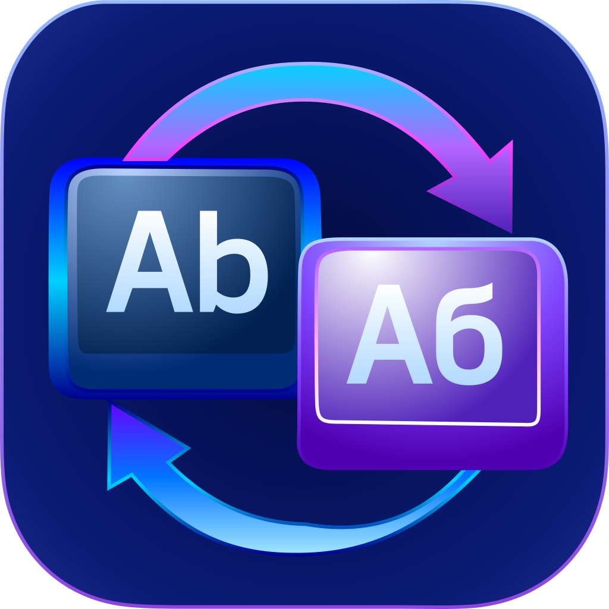
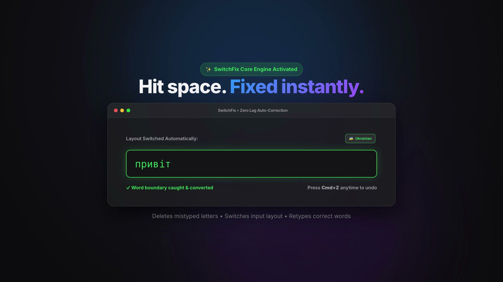

<p align="center">
  
</p>

# SwitchFix

A macOS menu bar utility that automatically corrects keyboard layout mistakes. Type in the wrong layout (e.g., English instead of Ukrainian/Russian) and SwitchFix detects it, deletes the mistyped word, switches the layout, and retypes the correct text — like PuntoSwitcher, but native, lightweight, and modern.

[](https://rundax.github.io/SwitchFix/)
[](https://rundax.github.io/SwitchFix/#video)
[](https://rundax.github.io/SwitchFix/tutorial/)
[](LICENSE)

<p align="center">
  <a href="https://rundax.github.io/SwitchFix/#video">
    
  </a>
  <br>
  <em>🎬 <strong><a href="https://rundax.github.io/SwitchFix/#video">Watch the 20-second video demo</a></strong> with sound and narration on the website.</em>
</p>


## Features

- **Automatic correction** — detects wrong-layout words on space/enter and corrects them instantly.
- **Hotkey mode** — correct only when you press Ctrl+Shift+Space (configurable).
- **Selection correction** — select text and press the hotkey to convert it.
- **Permissions indicator** — shows the status of required macOS permissions in the app menu.
- **Undo** — `Cmd+Z` within 5 seconds reverts the last correction.
- **Revert hotkey** — `CapsLock` reverts the last correction (configurable).
- **Three layouts** — English (US/ABC/British/Dvorak/Colemak), Ukrainian, and Russian.
- **Smart filtering** — skips password fields, URLs, emails, camelCase, mixed scripts.
- **App blacklist** — disabled in terminals, IDEs, and code editors by default (toggle per app).
- **Launch at Login** — optional auto-start.

## Requirements

- macOS 13.0 or later

## Installation

**SwitchFix is free to install and use; no payment to Apple is required.** Public releases are **ad-hoc signed, not notarized by Apple**. This keeps distribution independent of a paid Apple Developer Program membership, but macOS can block the first launch until you explicitly approve the app. The installer does not disable Gatekeeper or automatically bypass this approval.

### 1. Install SwitchFix

Open Terminal and run this command as your signed-in user, **without `sudo`**:

```bash
/bin/bash -o pipefail -c 'curl --fail --location --silent --show-error https://raw.githubusercontent.com/rundax/SwitchFix/master/install.sh | /bin/bash'
```

The installer downloads the native release for your Mac, checks its archive, architecture, macOS compatibility, and code seal, installs it to `/Applications/SwitchFix.app`, then attempts to open it. These checks verify the bundle's format and integrity; they are not Apple notarization or a guarantee that the app is safe. Only install it if you trust this project and its download source.

**Prefer a manual download?** Open the [latest GitHub release](https://github.com/rundax/SwitchFix/releases/latest), download `SwitchFix-arm64.app.zip` for Apple Silicon or `SwitchFix-intel.app.zip` for Intel, extract it, and move `SwitchFix.app` to `/Applications`. Open it and continue below. Version 0.0.10 and later use ZIP downloads, not DMG installers.

### 2. Approve the first launch in macOS

If you see **“SwitchFix” Not Opened** and **“Apple could not verify “SwitchFix” is free of malware…”**, the app has been installed but Gatekeeper has blocked it because this build is not notarized. That message alone is not a malware detection; it also does not establish that the app is safe.

Only proceed for the app you intentionally downloaded from this repository and trust:

1. Click **Done** in the warning, **not Move to Bin**.
2. Open **System Settings → Privacy & Security**.
3. Scroll down to the **Security** section. Find the message that SwitchFix was blocked and click **Open Anyway**.
4. Authenticate with Touch ID or your Mac password if requested, then click **Open** in the confirmation. The exact order of prompts can vary by macOS version.
5. If SwitchFix does not launch automatically, open **Finder → Applications → SwitchFix** again. It runs in the menu bar, so look for the **Ab** icon rather than a Dock icon.

**No Open Anyway button?** Try opening `/Applications/SwitchFix.app` again, click **Done**, and return to Privacy & Security. Apple makes this option available for about an hour after a blocked launch. If this is a managed work or school Mac, your organization's policy may prevent approval; contact its administrator rather than bypassing the policy.

**Clicked Move to Bin?** Run the installer again (or restore the trusted app to Applications), then repeat the steps above.

Do not disable Gatekeeper system-wide or remove quarantine attributes as a routine installation step. These instructions are for the unverified-developer warning, not a warning that macOS has detected malware. See [Apple’s guidance for opening apps safely](https://support.apple.com/en-us/102445).

### 3. Complete SwitchFix's permission setup

Gatekeeper approval lets the app launch; it does **not** grant permission to monitor or correct typing.

1. In SwitchFix's setup window, use **Open Settings + Show App** for **Accessibility**. Enable the installed `SwitchFix.app` in **System Settings → Privacy & Security → Accessibility**; use **+** to add it from Applications if needed.
2. If **Keyboard input access** is **Unavailable**, use the setup window's Input Monitoring button and enable or add SwitchFix in **Privacy & Security → Input Monitoring**. Restart SwitchFix if macOS requests it.
3. Return to SwitchFix and wait for the live access check, or click **Check Again**.
4. If prompted, add at least two supported keyboard layouts in **System Settings → Keyboard → Text Input → Edit**.
5. Once the window shows **Setup complete**, use **Try a correction** to verify that correction works.

macOS can provide keyboard-listening access through Accessibility without listing SwitchFix under Input Monitoring. **Keyboard input access — Available** means listening is allowed; it does not claim that a separate Input Monitoring toggle is enabled. You do not need to add an Input Monitoring entry just to make that pane match a screenshot. Setup completion reflects current access, keyboard-monitor health, and mode prerequisites; temporary pauses in excluded apps or password fields do not undo it.

Launch at Login is optional and can be enabled in SwitchFix's Settings.

### Updating or repairing permissions

Run the same installer command to update. It preserves the previous app if replacement fails, but after a successful replacement it attempts to clear stale SwitchFix permission registrations. Because ad-hoc signatures do not provide a stable publisher identity, expect to grant permissions again after an update; macOS may also require another **Open Anyway** approval.

If a permission is checked but SwitchFix still reports **Not allowed** or **Unavailable**:

1. Use **Open Settings + Show App** to open the affected permission pane and reveal the current app in Finder.
2. Select the old SwitchFix entry, click **−**, then click **+** and add `/Applications/SwitchFix.app` again. Enable its toggle.
3. Repeat in any other affected pane, restart SwitchFix if requested, then return to **Check Again**.

> **Visual setup guide:** Follow the [Interactive Setup Guide](https://rundax.github.io/SwitchFix/tutorial/) for permission walkthroughs and practice simulators. First complete the Gatekeeper approval above if macOS will not open the app.
> **Website:** Explore the [SwitchFix landing page](https://rundax.github.io/SwitchFix/) and its live typo simulator.

## Menu Bar Options

SwitchFix lives in your menu bar with an **Ab** icon. The menu provides:
- **Enable/Disable** toggle
- **Correction Mode** — Automatic or Hotkey Only
- **Permissions Status** — visually indicates if required permissions are granted
- **Installed Layouts** — shows all detected system layouts
- **Launch at Login** — toggle automatic startup

## Advanced Configuration

SwitchFix stores hotkeys in `UserDefaults`. Customize via Terminal:

```bash
# Revert hotkey: CapsLock (no modifiers)
defaults write com.switchfix.app SwitchFix_revertHotkeyKeyCode -int 57
defaults write com.switchfix.app SwitchFix_revertHotkeyModifiers -int 0

# Correction hotkey: Ctrl+Shift+Space
defaults write com.switchfix.app SwitchFix_hotkeyKeyCode -int 49
defaults write com.switchfix.app SwitchFix_hotkeyModifiers -int $((262144+131072))
```

## How It Works

1. **KeyboardMonitor** securely captures keystrokes without blocking them.
2. Characters accumulate in a short-lived **LayoutDetector** word buffer.
3. On a word boundary (space, enter, tab), the buffer is checked against alternative layout dictionaries (e.g. checking if an English typo forms a valid Ukrainian word).
4. If a valid word is found in another layout, **TextCorrector** safely deletes the mistyped characters, switches your input layout, and retypes the correct word.

## License

MIT
