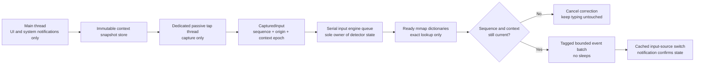

# Zero-Lag Input Pipeline Redesign

> **Status**: Approved implementation handoff
> **Priority**: Critical
> **Baseline**: `develop` at `0d3aa2e`
> **Date created**: 2026-08-06
> **Scope**: Keyboard capture, detection scheduling, correction emission, dictionary readiness, focus security, and regression coverage

---

## 1. Objective

Redesign SwitchFix so it cannot make normal typing lag, lose detector state, or apply a correction to text typed after the triggering boundary, including on older supported Macs.

The governing rule is:

> Physical input always wins. Observation may be skipped, and correction may be cancelled, but SwitchFix must never delay physical input or mutate text when its context is stale.

This is an implementation document, not an exploration. The decisions below are locked unless a platform API makes one impossible and a regression test demonstrates that impossibility.

---

## 2. Evidence and Current Failure Modes

### 2.1 What the `cccode` log establishes

The detector appends every received character in `LayoutDetector.addCharacter` and only logs the completed buffer later. Therefore:

- `Detection: checking buffer 'cccode'` means the monitor observed three `c` key-down characters before dictionary detection started.
- The `no valid alternative found` branch did not create those characters.
- The current log cannot distinguish hardware autorepeat, another process's synthetic event, or delayed/duplicated observation because it does not record event origin metadata.
- Do not “fix” this by discarding autorepeat events. The target application receives legitimate autorepeat events, so discarding them only from SwitchFix would make detector state diverge from visible text.

The running app was inspected and uses a session-level passive event tap. A passive tap cannot modify or divert the event stream. See Apple's [`CGEventTapCallBack`](https://developer.apple.com/documentation/coregraphics/cgeventtapcallback) documentation.

### 2.2 Confirmed architectural defects

1. `KeyboardMonitor` installs the tap source on the main run loop.
2. Every captured event is dispatched back to the main queue before state is updated.
3. Dictionary detection runs synchronously on main at a word boundary.
4. `TextCorrector` sleeps on main while emitting deletes, text, paste, and layout changes.
5. While `KeyboardMonitor.isPaused` is true, physical keys still reach the target application but are not added to the detector buffer.
6. Correction completion is based on fixed 50/150 ms timers, not an event identity or completion condition.
7. App, layout, secure-focus, and preference state are sampled after capture rather than stored with the captured event.
8. A typo-tolerant automatic lookup can construct a runtime trigram index over 2,958,567 Ukrainian words while holding the global dictionary lock.
9. Release logging records typed words and performs synchronous logging on the detection path.
10. There are no executable tests for capture ordering, correction emission, focus/layout epochs, timeout recovery, or real input during correction.

### 2.3 Components that should remain

Do not rewrite the layout mapping or exact dictionary format.

- The packaged app already uses the `.bin` mmap dictionaries.
- The observed live physical footprint was approximately 15 MB.
- Exact dictionary membership and current layout heuristics are suitable once they are isolated from capture.

---

## 3. Required Invariants

The implementation is complete only when all invariants hold.

### Capture invariants

1. The event tap runs on a dedicated run-loop thread, never on the main run loop.
2. The callback does bounded work only: read fields, assign a sequence, read an immutable context snapshot, enqueue, return.
3. The callback performs no AX call, TIS enumeration, dictionary lookup, `UserDefaults` read, logging, sleep, or main-queue dispatch.
4. Captured physical events retain their original order.
5. Autorepeat events are preserved and labeled.
6. A tap timeout/reset invalidates detector state before further correction is allowed.

### State invariants

1. One serial queue owns the detector buffer, correction history, and edit generation.
2. Each captured event contains the app/layout/security epoch that was current at capture time.
3. Events from a stale epoch are discarded and cause buffer invalidation; they are never applied under a newer context.
4. Secure or unknown focus never contributes characters to a detector buffer.
5. Queue overload disables correction and invalidates the buffer; it never blocks capture.

### Correction invariants

1. Every correction is tied to the boundary sequence and context epoch that produced it.
2. Immediately before emitting a correction, the latest captured physical sequence must still equal the boundary sequence.
3. If the user typed, navigated, changed app, changed focus, or changed layout, the correction is cancelled.
4. SwitchFix-generated events have a stable, nonzero `eventSourceUserData` marker.
5. Generated events are ignored by identity, not by a timer.
6. Physical events are never ignored during correction.
7. No `usleep`, `Thread.sleep`, semaphore wait, or synchronous main-queue hop exists in the capture/detection/correction path.
8. Automatic correction uses a bounded event batch. A word longer than 64 grapheme clusters is never automatically corrected.

### Dictionary invariants

1. Automatic detection performs exact membership checks only.
2. All enabled exact indexes are ready before automatic monitoring becomes active.
3. A release build never parses the multi-megabyte text dictionaries as a runtime fallback.
4. Missing/corrupt binary dictionaries disable the affected correction target and surface a diagnostic; typing continues normally.
5. No runtime trigram index is built.

---

## 4. Target Flow



### Event sequence

1. A physical event reaches the passive session tap.
2. The tap thread increments `physicalSequence` and extracts event metadata.
3. It reads the current `InputContextSnapshot` from a short `OSAllocatedUnfairLock` critical section.
4. It enqueues a `CapturedInput` onto `inputEngineQueue` and immediately returns the original event.
5. The engine processes inputs in capture order.
6. A boundary creates a correction candidate using ready exact dictionaries.
7. Before emission, the engine compares the candidate sequence/epoch with the latest capture state.
8. A mismatch cancels the correction without altering target text.
9. A match emits tagged deletes and corrected Unicode text without sleeps.
10. Any requested layout switch uses a cached `TISInputSource`; the normal TIS notification updates the context epoch.

---

## 5. Concrete Types and Ownership

Add `Sources/Core/CapturedInput.swift` with these concepts. Exact naming may follow Swift style, but do not merge them with AppKit/UI types.

```swift
public enum SecureFocusState: Equatable {
    case unknown
    case secure
    case notSecure
}

public struct InputContextSnapshot: Equatable {
    public let epoch: UInt64
    public let frontmostPID: pid_t
    public let appAllowed: Bool
    public let layout: Layout
    public let inputSourceID: String
    public let secureFocus: SecureFocusState
}

public struct CapturedInput {
    public enum Kind {
        case character(String)
        case boundary(String)
        case delete
        case navigation
        case hotkey
        case revertHotkey
        case undo
        case focusMayChange
        case tapReset
    }

    public let sequence: UInt64
    public let timestamp: UInt64
    public let kind: Kind
    public let keyCode: UInt16
    public let flagsRawValue: UInt64
    public let isAutorepeat: Bool
    public let sourcePID: Int32
    public let sourceUserData: Int64
    public let context: InputContextSnapshot
}
```

Use primitive values in `CapturedInput`; do not retain `CGEvent`, `AXUIElement`, `TISInputSource`, `NSEvent`, or UI objects across queues.

### Ownership table

| State/resource | Sole owner | Other access |
|---|---|---|
| Event tap and tap run loop | Dedicated tap thread | Start/stop via run-loop blocks |
| Physical sequence and context snapshot | `OSAllocatedUnfairLock` state | Tiny read/update critical sections only |
| Detector buffer and edit generation | `inputEngineQueue` | No direct main/tap access |
| `LayoutDetector` | `inputEngineQueue` | No main-thread calls |
| `TextCorrector` transaction/undo state | `inputEngineQueue` | UI receives immutable status snapshots |
| Dictionary indexes | Immutable after preparation | Concurrent exact reads allowed |
| Preferences snapshot | Main creates, snapshot store publishes | Tap/engine read snapshot values only |
| AX focus observer | Main/context coordinator | Publishes secure state asynchronously |
| Status bar/settings | Main thread | Never called synchronously from tap/engine |

---

## 6. File-by-File Implementation Plan

Implement sequentially. Keep each numbered section as a buildable commit.

### 6.1 Add deterministic diagnostics first

Files:

- `Sources/Core/KeyboardMonitor.swift`
- New: `Sources/Core/CapturedInput.swift`

Changes:

1. Extract these CoreGraphics fields for every key-down:
   - `keyboardEventKeycode`
   - `keyboardEventAutorepeat`
   - `eventSourceUnixProcessID`
   - `eventSourceUserData`
   - flags and event timestamp
2. Add a 256-entry fixed-size metadata ring owned by the tap thread.
3. Do not store typed Unicode, clipboard data, selected text, or full words in the diagnostic ring.
4. Replace release word logging with content-free fields: word length, layout, result category, sequence, and duration.
5. Tag every later SwitchFix-generated event with the process-wide marker `0x53574649585F3031` (`SWFIX_01`).
6. When the tap reports `.tapDisabledByTimeout` or `.tapDisabledByUserInput`, re-enable it, enqueue `.tapReset`, increment a counter, and clear pending correction eligibility.

The ring is diagnostic only. Do not implement event deduplication.

### 6.2 Move capture off the main run loop

File:

- `Sources/Core/KeyboardMonitor.swift`

Changes:

1. `KeyboardMonitor.start()` creates a dedicated named `Thread`.
2. That thread creates the event tap, creates the `CFMachPort` run-loop source, attaches it to `CFRunLoopGetCurrent()`, signals startup success/failure, and runs the loop.
3. Keep `.listenOnly` and prefer `.cgSessionEventTap`; retain the existing HID fallback.
4. `start()` may wait only for initial tap creation, with a one-second timeout. This occurs once at startup, not while monitoring.
5. `stop()` performs removal, invalidation, and `CFRunLoopStop` on the tap run loop. It must be idempotent.
6. Replace delegate callbacks with one closure or delegate method accepting `CapturedInput`. That receiver only enqueues onto `inputEngineQueue`.
7. Remove all `DispatchQueue.main.async` calls from the tap callback.
8. Read the event's Unicode string in the callback because the `CGEvent` is not retained. For HID fallback, use a precomputed immutable translation table published on input-source changes.
9. Remove `TISGetInputSourceProperty`, `UCKeyTranslate`, cache mutation, and `NSLock` work from the callback.
10. Add mouse-down event types only as `focusMayChange` invalidators. They are never buffered as text.

Callback budget: p99 below 250 microseconds and no individual callback above 1 millisecond in the integration stress run.

### 6.3 Introduce the serial input engine

Files:

- New: `Sources/Core/InputEngine.swift`
- New: `Sources/Core/InputStateMachine.swift`
- `Sources/SwitchFixApp/AppDelegate.swift`
- `Sources/Core/LayoutDetector.swift`

Changes:

1. Add one `DispatchQueue(label: "com.switchfix.input-engine", qos: .userInteractive)`.
2. `InputStateMachine` is platform-free. It consumes `CapturedInput` values and returns commands such as append, flush, invalidate, undo, or manual correction. This is the seam used by the standalone regression runner; it does not load a dictionary.
3. `InputEngine` owns `InputStateMachine`, `LayoutDetector`, `TextCorrector`, latest processed sequence, and user edit generation.
4. `AppDelegate` creates immutable startup/configuration snapshots and sends context-change messages to the engine. It no longer implements per-character detector logic.
5. Character, boundary, delete, navigation, undo, hotkey, and revert handling move from `AppDelegate` into `InputEngine` without changing their product semantics.
6. A character is accepted only when:
   - SwitchFix is enabled.
   - The app is allowed.
   - `secureFocus == .notSecure`.
   - The event context epoch equals the engine context epoch.
7. Unknown/secure focus, navigation, tap reset, queue overload, app change, or layout change clears the word buffer and cancels pending correction.
8. Cap automatic buffer length at 64 grapheme clusters. On overflow, invalidate until the next boundary.
9. Track enqueued depth with the existing lock-protected capture state. Above 256 pending inputs, stop enqueueing characters until a boundary/control event and enqueue one invalidation marker. Never block the tap callback waiting for queue capacity.
10. Cache `PreferencesManager` values in a small immutable preferences snapshot updated only by `.preferencesDidChange`.
11. Keep integration seams as initializer closures, not protocols or factories: exact detection, correction emission, latest capture-state read, and selected-text request. Production closures wrap the existing concrete objects; the regression runner supplies bounded fakes.

Do not convert the project to Swift actors or add a package dependency. The deployment target and existing Swift toolchain already support the required serial queue and `OSAllocatedUnfairLock` pattern.

### 6.4 Make automatic dictionary work bounded

Files:

- `Sources/SwitchFixApp/AppDelegate.swift`
- `Sources/Core/LayoutDetector.swift`
- `Sources/Dictionary/DictionaryLoader.swift`
- `Sources/Dictionary/WordValidator.swift`
- `Sources/Dictionary/SuggestionEngine.swift`
- `Sources/Dictionary/TrigramIndex.swift`

Changes:

1. Before monitoring starts, prepare exact indexes for every installed and allowed layout on a utility queue.
2. Start monitoring on main only after preparation completes.
3. If preparation fails for one language, remove that layout from `allowedLayouts`, report a non-blocking status warning, and continue with the remaining languages.
4. In release builds, `DictionaryLoader` must not instantiate `TextDictionary(url:)`. Missing/invalid `.bin` returns a failed/unavailable language.
5. Keep text fallback only for explicit debug/test tooling. Add `DictionaryLoader.enableTextFallbackForTesting()` and call it at the start of the existing `TestRunner`; production code must never call it.
6. Remove the automatic 4–5 character typo-suggestion branch from `LayoutDetector`.
7. Remove `DictionaryLoader.trigramIndices`, `suggestionCandidates`, and `ensureTrigramIndexLoaded`.
8. Remove long-word `dictionarySuggestion` from `SuggestionEngine` and `WordValidator`.
9. Retain the small in-memory `shortWords` sets and their bounded short-word behavior.
10. Delete `TrigramIndex.swift` after `rg` confirms no remaining callers. Retain `DamerauLevenshtein.swift` only for the bounded short-word set; it must never scan a dictionary.
11. Keep exact alternative-layout validation, allow/deny overrides, Ukrainian variant handling, contextual short-word suppression, and explicit Ukrainian typo overrides.

Intentional behavior change: automatic typo-tolerant dictionary suggestions are removed. Exact wrong-layout correction remains. Reintroduce typo suggestions only as a separately benchmarked, build-time-generated mmap artifact with a hard query bound; never rebuild a whole-language index at runtime.

### 6.5 Replace timed correction with an identity-based transaction

Files:

- `Sources/Core/TextCorrector.swift`
- `Sources/Core/InputEngine.swift`
- `Sources/Core/KeyboardMonitor.swift`
- `Sources/Core/InputSourceManager.swift`

Changes:

1. Create one `CGEventSource(stateID: .privateState)` for all SwitchFix-generated events.
2. Set its `userData` to `0x53574649585F3031` and its local-event suppression interval to zero.
3. The tap callback returns immediately for events with the SwitchFix marker. Keep this check even though annotated-session posting is downstream of the normal session tap.
4. Delete `KeyboardMonitor.isPaused`, `onKeyDownWhilePaused`, `onCorrectionStarted`, and `onCorrectionFinished` filtering.
5. Delete every `usleep` from `TextCorrector`.
6. Build a bounded correction plan containing:
   - Boundary sequence and context epoch.
   - Target PID.
   - Delete count.
   - Corrected text plus boundary.
   - Optional target layout.
7. Immediately before posting, require:
   - Latest physical sequence equals boundary sequence.
   - Context epoch and frontmost PID still match.
   - Secure focus remains `.notSecure`.
8. Post delete key pairs without sleeps.
9. Post corrected text plus boundary in one Unicode key-down/key-up pair. If the compatibility smoke test identifies an application that rejects multi-character Unicode events, use per-grapheme tagged pairs without sleeps as the fallback. Do not restore timing sleeps.
10. After event posting, record undo state directly. No resume timer is needed because generated events are identity-filtered.
11. A later physical event increments user edit generation and invalidates undo exactly once.
12. Cache the actual target `TISInputSource` objects during source discovery. `switchTo` performs one `TISSelectInputSource` call; it does not enumerate sources.
13. Remove the 150 ms layout-switch timer and 10 ms sleep. The normal selected-input-source notification confirms and publishes the new layout.

Selection correction remains manual and may use `NSPasteboard`, but it must be an asynchronous main-thread state machine:

1. Save and replace clipboard contents on main.
2. Post a tagged Command-V pair without sleeping.
3. Restore the clipboard with an asynchronous timer.
4. Do not pause capture while waiting.
5. Discard an AX/selection result if its context epoch or target PID changed.

### 6.6 Make focus and Accessibility checks fail closed

Files:

- `Sources/Utils/Permissions.swift`
- `Sources/SwitchFixApp/AppDelegate.swift`
- `Sources/Core/InputEngine.swift`

Changes:

1. Replace the 500 ms per-key-triggered secure-field cache with a focus coordinator.
2. On app activation, mouse down, Tab/navigation, or AX focused-element notification:
   - Increment context epoch.
   - Publish `secureFocus = .unknown`.
   - Clear detector state.
   - Resolve the focused role asynchronously.
3. Register an `AXObserver` for the frontmost process and `kAXFocusedUIElementChangedNotification`. Tear it down on app change.
4. Attach the AX observer source to the main run loop. Its callback only publishes `.unknown` and queues the role query; it performs no AX query inline.
5. A `focusMayChange` event publishes `.unknown` and waits for the AX notification. For applications that do not deliver the notification, schedule one 25 ms asynchronous fallback query tied to the same epoch; reject a late result after any epoch change.
6. Apply a 50 ms AX messaging timeout to the target application element.
7. Publish `.secure` only for `AXSecureTextField`; publish `.notSecure` after a successful non-secure role result.
8. Timeout, unsupported attributes, process exit, or AX failure leaves the state `.unknown` and disables buffering for that focus epoch.
9. Manual selected-text queries run off main, use the captured target PID, and return through the epoch gate.

Do not weaken this to an optimistic default. Unknown is secure for buffering purposes.

### 6.7 Remove sensitive synchronous logging

Files:

- `Sources/Core/LayoutDetector.swift`
- `Sources/Core/TextCorrector.swift`
- `Sources/Core/InputEngine.swift`

Changes:

1. Remove full typed words and selected text from release logs.
2. Use `Logger`/signposts for durations and content-free result categories.
3. Record:
   - Tap callback duration histogram.
   - Tap reset count.
   - Maximum engine queue depth.
   - Dictionary lookup duration.
   - Corrections applied.
   - Corrections cancelled by sequence/context/security.
   - Buffer invalidations by reason.
4. Keep verbose text logging behind a compile-time debug flag only; default it off.

---

## 7. Regression Harness

Do not rely on the existing full `TestRunner` for pipeline verification. It packages text dictionaries, performs multi-million-word work, and does not cover keyboard/correction behavior.

Add a small standalone executable target:

- New target in `Package.swift`: `InputPipelineTestRunner`
- New directory: `Sources/InputPipelineTestRunner/`
- It may depend on `Core` and `Utils` but must not load dictionary resources.
- It uses the existing simple `assert` style; do not add XCTest or a dependency.

Required deterministic checks:

1. `c`, `o`, `d`, `e`, boundary produces exactly `code` once and in order.
2. Two `c` events labeled autorepeat remain two visible detector characters; they are not silently removed.
3. A SwitchFix-tagged event is ignored regardless of how late it arrives.
4. Physical input during the old 50/150 ms windows remains represented exactly once because those windows no longer exist.
5. A correction candidate is cancelled when a later physical sequence exists.
6. A candidate is cancelled after app, layout, focus, security, navigation, or tap-reset epoch changes.
7. Unknown and secure focus never add characters to the buffer.
8. A buffer longer than 64 graphemes invalidates until boundary.
9. Queue overflow results in invalidation and zero correction, not blocking.
10. A correction plan emits exactly N tagged delete pairs plus one tagged Unicode replacement pair.
11. Undo is available only until the next physical edit generation.
12. A missing dictionary reports unavailable and never invokes text fallback in release configuration.
13. Feed 100,000 numbered physical events plus interleaved tagged events; assert:
    - No physical event loss.
    - No duplication.
    - No reordering.
    - All tagged events ignored.
    - Final detector state matches the physical stream.
14. Block fake AX, TIS, and dictionary collaborators for five seconds; captured-event routing must still complete without waiting.

Add one opt-in macOS integration smoke executable or mode, skipped when TCC permission is absent:

1. Focus a local `NSTextView`.
2. Post tagged correction events.
3. Verify the received text and event count.
4. Verify multi-character Unicode event compatibility.
5. Type/replay physical events during correction and verify exact final text.
6. Exercise tap timeout recovery and confirm correction remains disabled until state is rebuilt.

---

## 8. Verification Commands

Run from the repository root:

```bash
swift build -c release
swift run -c release InputPipelineTestRunner
./scripts/build-app.sh
```

Then run the opt-in integration smoke test with Accessibility and Input Monitoring granted.

Before declaring completion:

```bash
rg -n "usleep|Thread\.sleep|isPaused|onKeyDownWhilePaused|ensureTrigramIndexLoaded|suggestionCandidates" Sources
rg -n "NSLog.*word|NSLog.*selected|NSLog.*buffer" Sources
git diff --check
git status --short
```

Expected search result: no capture/detection/correction sleep or timed pause remains; no runtime trigram path remains; no release plaintext typing log remains.

---

## 9. Performance and Reliability Acceptance Criteria

Test on the oldest available supported Intel Mac as well as the development Mac.

1. Passive tap callback p99 is below 250 microseconds under typing and CPU pressure.
2. No callback exceeds 1 millisecond during the integration stress run.
3. Tap-disabled-by-timeout count remains zero during ten minutes of 100 key events/second synthetic stress.
4. Ready exact dictionary lookup p99 is below 5 milliseconds.
5. No runtime operation builds an index proportional to total dictionary word count.
6. Automatic correction emission contains no fixed wait and completes its event posting in under 5 milliseconds p99 for words up to 20 graphemes.
7. The 100,000-event deterministic test has zero loss, duplication, and reordering.
8. With AX/TIS/dictionary collaborators deliberately blocked, target typing remains unaffected and correction is skipped.
9. User input arriving after a boundary causes cancellation, never deletion of the newer input.
10. Secure/unknown focus produces no buffered text and no plaintext diagnostic content.
11. Missing/corrupt binary dictionaries cause a visible degraded state, not text parsing or typing lag.
12. Release app physical footprint remains below 30 MB before optional UI windows are opened.

---

## 10. Compatibility Matrix

Manually verify automatic correction, manual selection correction, undo, and layout switching in:

- AppKit `NSTextView` test host.
- TextEdit.
- Terminal.
- Zed.
- One Electron application.
- One JetBrains editor if available.
- A secure password field.

For every application record:

- Multi-character Unicode event supported: yes/no.
- Boundary preserved exactly once: yes/no.
- Correction deletes exactly the intended word: yes/no.
- Immediate continued typing cancels safely: yes/no.
- Undo restores original word and boundary: yes/no.

If an application rejects the single Unicode pair, enable the no-sleep per-grapheme fallback for that compatibility class. Do not add app-specific timing delays.

---

## 11. Explicit Non-Goals

Do not add any of the following during this redesign:

- An active/filtering event tap that suppresses normal physical keys.
- A third-party atomics, queue, logging, or dictionary dependency.
- A new dictionary format.
- Runtime machine-learning detection.
- Runtime construction of a whole-dictionary suggestion index.
- App-specific sleep values.
- Automatic removal of hardware autorepeat characters.
- Broad UI redesign.
- Behavior changes to exact wrong-layout mapping beyond removal of typo-tolerant long-word suggestions.

---

## 12. Rollout and Failure Policy

1. Land the diagnostic metadata and pure regression runner first.
2. Land the dedicated tap thread and serial engine while corrections are temporarily exact-only.
3. Land identity-tagged, generation-gated, no-sleep correction.
4. Land focus/AX fail-closed handling.
5. Remove runtime trigram code and release text fallback.
6. Run the compatibility matrix and old-Mac stress gate.
7. Ship only after the deterministic and integration gates pass.

At runtime, every uncertain state fails open for typing and closed for correction:

| Condition | Required behavior |
|---|---|
| Dictionary unavailable/not ready | Pass typing; skip correction |
| Engine queue overloaded | Pass typing; invalidate buffer |
| App/layout/focus epoch changed | Pass typing; cancel candidate |
| Secure focus unknown | Pass typing; do not buffer |
| AX query timed out | Pass typing; do not buffer |
| Tap reset/timeout | Re-enable tap; invalidate state; no correction until new boundary context |
| User typed after boundary | Pass typing; cancel candidate |
| Generated event observed | Ignore by marker |

---

## 13. Definition of Done

The redesign is done when:

1. All required invariants in section 3 are enforced by code and deterministic checks.
2. All automatic-path sleeps, timer-based pause filtering, runtime trigram construction, and release text fallback are removed.
3. Main owns UI/system-notification work only; tap and detector state do not depend on main responsiveness.
4. A correction cannot be applied after any newer physical event or context change.
5. Secure/unknown fields cannot enter the detector buffer or plaintext logs.
6. The standalone pipeline runner, release build, app build, and integration smoke test pass.
7. The compatibility matrix has no unresolved text-loss, duplication, or boundary failures.
8. Old-Mac performance criteria pass with evidence saved under `plan/benchmarks/`.
9. No unrelated refactor or dependency is included.
